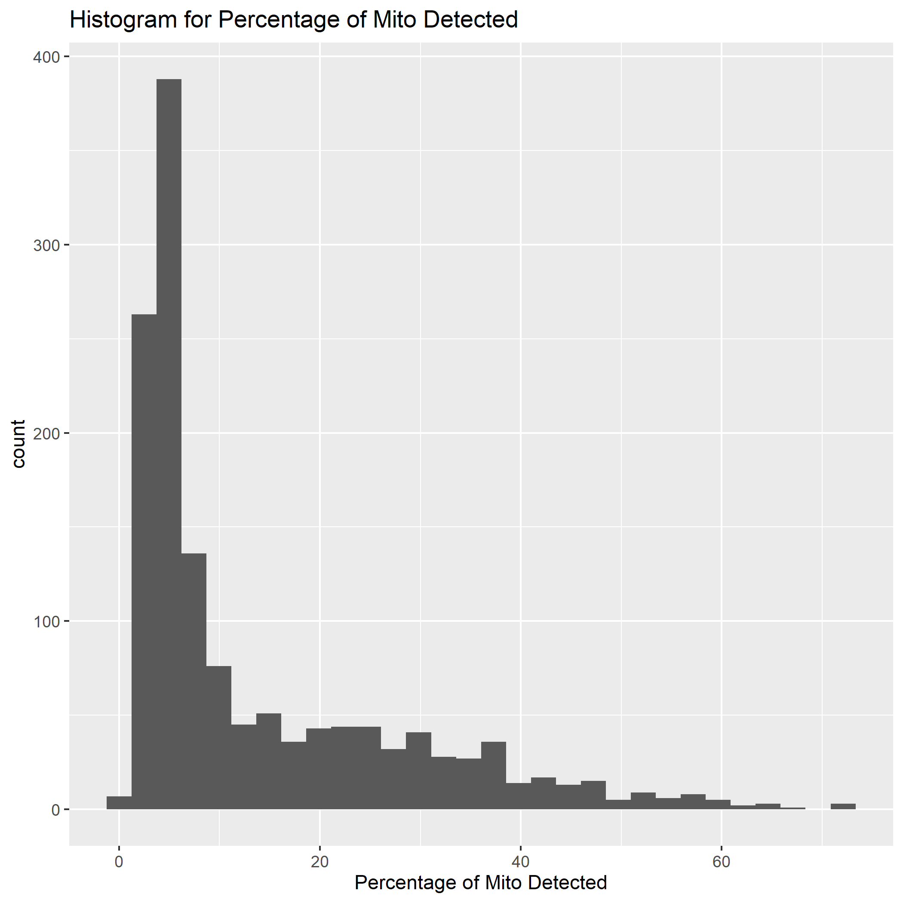
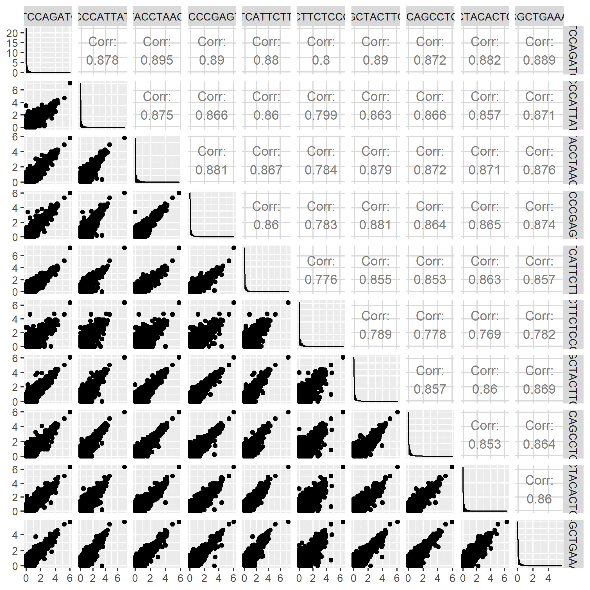
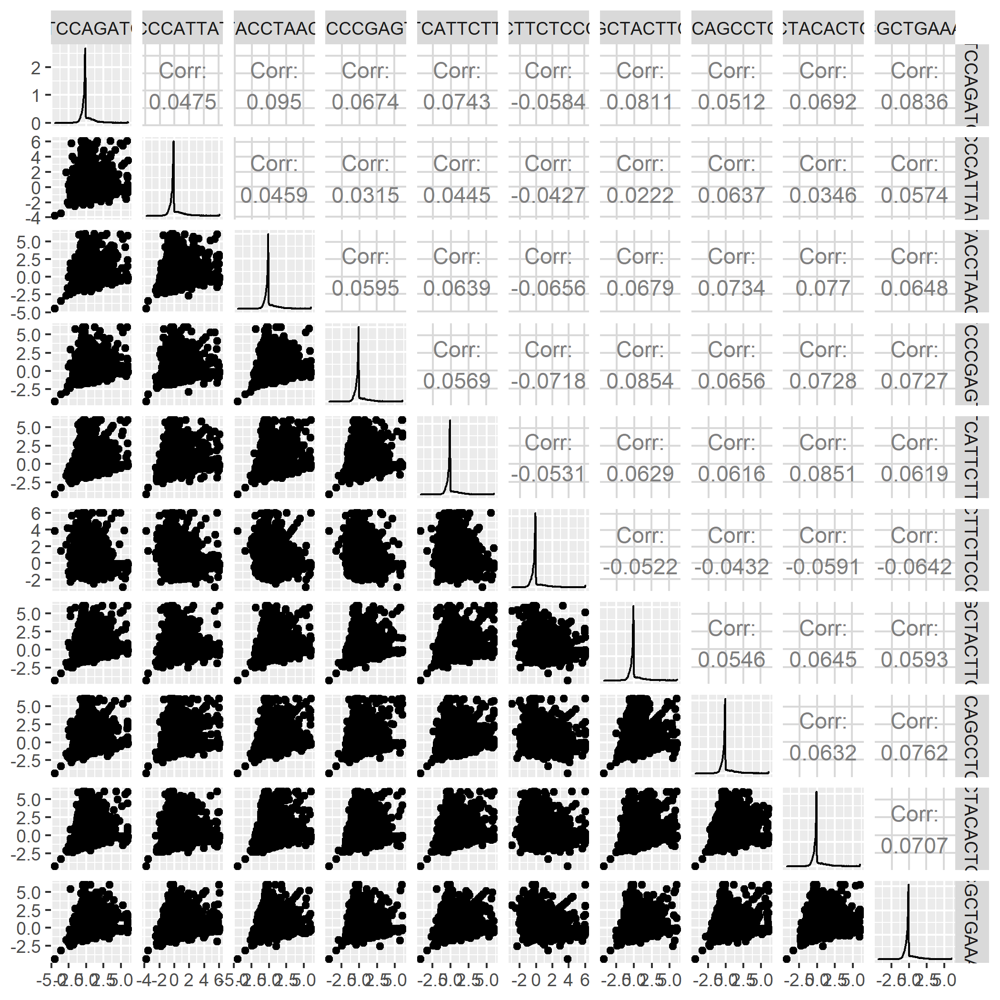

```{r setup, include=FALSE}
knitr::opts_chunk$set(echo = TRUE)
knitr::opts_chunk$set(warning = FALSE)
knitr::opts_chunk$set(memessage = FALSE)
```

## 1. Wrangling scRNA-seq data in R using bioconductor packages

### Read count matrix into R. What do the columns represent? What do the rows represent?

```{r, results='hide'}
count <- read.table("./WT-1.dge.txt", header = T)
dim(count)
length(unique(colnames(count)))
```

Each row is a gene and each column is a 12-based cell barcode fragment which represents a unique cell.

### Create a `SingleCellExperiment` object.

```{r, message=F}
library(SingleCellExperiment)
library(scater)
rownames(count) <- count$GENE
count <- as.matrix(count[,-1])
sce <- SingleCellExperiment(assays = list(counts = count))
```

### Show a snippet of the count matrix that is now part of the `SCE` object.

```{r}
counts(sce)[1:10,1:5]
```

### Calculate the numbers of reads (~sequence depths) for the first five cells, i.e. you should have 5 values in the end.

```{r}
sce <- addPerCellQC(sce)
colData(sce)$sum[1:5]
#colSums(counts(sce)[,1:5])
```

### How many genes have non-zero counts in the first five cells?

```{r}
sce <- addPerFeatureQC(sce)
#sum(rowData(sce[,1:5])$mean!=0) this not work
sum(rowSums(counts(sce)[,1:5])!=0)
```

### If you were to change the row- and column-names of the original matrix, how could you keep track of the original names?

```{r}
colData(sce)$original_names <- colnames(counts(sce))
rowData(sce)$original_names <- rownames(counts(sce))
```

### Following the scater workflow, generate histograms or density plots of (a) the total number of UMI counts per cell and (b) total number of expressed genes.

```{r, message=F}
library(ggplot2)
library(AnnotationHub)
col_df <- data.frame(sum = colData(sce)$sum,
                     expressed_gene = colData(sce)$detected,
                     row.names = rownames(colData(sce)))

ggplot(col_df, aes(x=sum)) + geom_histogram() + labs(x = "total UMI counts", title = "Histogram of UMI Counts Per Cell")

ggplot(col_df, aes(x=expressed_gene)) + geom_histogram() + labs(x = "Number of expressed genes", title = "Histogram of Number of Expressed Genes Per Cell")
```

- Describe in your own words what the two different histograms show and what that means for the data at hand.

From the histogram of UMI counts, we can see that most of cells have around 2000 UMI counts and there is long tail upon high UMI counts. From the histogram of expressed genes, we also see a skewed figure towards low amount of genes but we can notice that there is few cells have extremely low expression and there is more counts on higher expressed-gene cells. That may indicate the expression of genes are not normal and need adjustment.

- For another extra-credit point, you could generate the histogram for "% mitochondria reads".

```{r, message=FALSE, eval=FALSE}
library(AnnotationHub)

ens.hs <- AnnotationHub()[["AH10684"]]
ens.hs.suppl <- AnnotationHub()[["AH79161"]]

#keytypes(org.Hs.eg.db)

ENSGID <- ens.hs$gene_id[match(rownames(sce), ens.hs$gene_name)]
ENSGID[is.na(ENSGID)] <- ens.hs.suppl$gene_id[match(rownames(sce)[is.na(ENSGID)], ens.hs.suppl$gene_name)]
#Those fail to map Gene ID could be non-coding RNA and old version gene names, and the others are pseudo gene, which would not be included in the final count matrix

mapping <- data.frame(chr = as.character(ens.hs@seqnames), ID = ens.hs$gene_id)
mapping_suppl <- data.frame(chr = as.character(ens.hs.suppl@seqnames), ID = ens.hs.suppl$gene_id)

location <- mapping$chr[match(ENSGID, mapping$ID)]
location[is.na(location)] <- mapping_suppl$chr[match(ENSGID, mapping_suppl$ID)][is.na(location)]

is.mito <- which(location == "MT")
MT_df <- perCellQCMetrics(sce, subsets=list(Mito=is.mito))

ggplot(as.data.frame(MT_df), aes(x = subsets_Mito_percent)) + geom_histogram() + labs(x="Percentage of Mito Detected", title = "Histogram for Percentage of Mito Detected")
#Warning coming from NaN value
ggsave("./Hist_Percentage_Mito.png")
save(MT_df, file = "MT_df.RData")
```



### Decide on some threshold for either QC parameters and remove the corresponding cells.

When using the manually set thresholds which is set based on the peaks of histograms retained above.

```{r}
load("MT_df.RData")
qc.lib <- colData(sce)$sum < 2000
qc.nexprs <- colData(sce)$detected < 500
qc.mito <- MT_df$subsets_Mito_percent > 10
discard <- qc.lib | qc.nexprs | qc.mito
DataFrame(LibSize=sum(qc.lib),
          NExprs=sum(qc.nexprs),
          MitoProp=sum(qc.mito, na.rm = T),
          Total=sum(discard))
```

We get 944 cells filtered.

By using adaptive threshold.

```{r}
qc.lib2 <- isOutlier(colData(sce)$sum, log = T, type = "lower")
qc.nexprs2 <- isOutlier(colData(sce)$detected, log = T, type = "lower")
qc.mito2 <- isOutlier(MT_df$subsets_Mito_percent, type = "higher")

discard2 <- qc.lib2 | qc.nexprs2 | qc.mito2

#This would be done by integrating WT_df into colData and then use quickPerCellQC(), specify percent_subsets="subsets_Mito_percent"

DataFrame(LibSize=sum(qc.lib2),
          NExprs=sum(qc.nexprs2),
          MitoProp=sum(qc.mito2, na.rm = T),
          Total=sum(discard2))

filtered_sce <- sce[,!discard2]
```

There are in total 326 disgarded.

### Using the filtered data set, normalize the counts using `scran` and `scater` and judge whether the size factors calculated by `computeSumFactors` show the expected behavior as shown in Figure 6 of the simpleSingleCell workflow

```{r}
library(scran)
library(scater)
#lib.sf <- librarySizeFactors(filtered_sce)

set.seed(1000)
clusters <- quickCluster(filtered_sce)
table(clusters)

filtered_sce <- computeSumFactors(filtered_sce, cluster = clusters)
summary(sizeFactors(filtered_sce))

plot(filtered_sce$total, sizeFactors(filtered_sce), log="xy")

filtered_sce <- logNormCounts(filtered_sce,)
```

- How can you access the normalized data matrix?

```{r}
logcounts(filtered_sce)[1:10,1:5]
```

## 2. scRNA-seq data wrangling in R using Seurat.

### Create a Seurat object

```{r, message=F}
library(Seurat)
scSeurat <- CreateSeuratObject(counts = count)
```

### Perform the same filtering that you choose to do on the SCE object.

```{r}
scSeurat <- scSeurat[,!discard2]
```

### Normalize the data using `scTransform`

```{r, message=F}
scSeurat <- PercentageFeatureSet(scSeurat, pattern = "^MT-", col.name = "percent.mt")

scSeurat <- SCTransform(scSeurat, vars.to.regress = "percent.mt", verbose = F, min_cells = 2, variable.features.n = nrow(scSeurat@assays$RNA))
```

- How can you access the normalized data matrix, i.e. the matrix of Pearson residuals

```{r}
scSeurat@assays$SCT@scale.data[1:5,1:5]
```

### For the first 10 cells, do pairwise comparisons for each cell of the normalized values from the Seurat object and the SCE object. Explain what you see.

```{r}
norm_sc_Seurat <- scSeurat@assays$SCT@scale.data[,1:10]
sum(rowSums(scSeurat@assays$RNA)==0)
# Data is good to use
#sum(rowSums(scSeurat@assays$SCT@scale.data)==0) there is no 0 count in the scaled data

p_val <- matrix(0, nrow = 10, ncol = 10)

for(i in 1:(nrow(p_val)-1)) {
  for(j in (i+1):ncol(p_val)) {
    p_val[i,j] <- t.test(norm_sc_Seurat[,i], norm_sc_Seurat[,j])$p.value
  }
}

adj.p_val <- p_val * choose(10,2)

sum(upper.tri(adj.p_val, diag = F) & adj.p_val < 0.05)

cellnames <- paste0("Cell", c(1:10))
rownames(adj.p_val) <- cellnames
colnames(adj.p_val) <- cellnames

for(idx in which(upper.tri(adj.p_val, diag = F) & adj.p_val < 0.05)){
  k <- arrayInd(idx, dim(adj.p_val))
  print(c(rownames(adj.p_val)[k[1]], colnames(adj.p_val)[k[2]]))
}
```

From the output of using Seurat data, there are 25 pairwise cells that have significantly different expression out of total 45 combination. And every cell is different from at least one cell in the first 10.

```{r}
norm_sc_SCE <- logcounts(filtered_sce)[,1:10]
sum(rowSums(counts(filtered_sce))==0)
#538
norm_sc_SCE <- norm_sc_SCE[!rowSums(counts(filtered_sce))==0,]

for(i in 1:(nrow(p_val)-1)) {
  for(j in (i+1):ncol(p_val)) {
    p_val[i,j] <- t.test(norm_sc_SCE[,i], norm_sc_SCE[,j])$p.value
  }
}

adj.p_val <- p_val * choose(10,2)

sum(upper.tri(adj.p_val, diag = F) & adj.p_val < 0.05)
```

However from the results of those from SCE data, there is no significantly different expression among the first 10 cells.

```{r, eval=F}
library(GGally)
ggpairs(as.data.frame(norm_sc_SCE))
ggpairs(as.data.frame(norm_sc_Seurat))
```



From the ggpair results, we can see that there is a strong correlation between cells.



However the correlation in the Seurat figure is quite weak.

Compared the two normalization algorithms, the log-normalize steps are almost the same except the type of scale factor to be used. However, in Seurat, the `ScaleData()` function integrated in the `SCTransform` takes into account the mito_percentage and re-scale and filter genes, returning pearson residuals and these residuals would have 0 mean and 1 variance for each gene across all cells. From the processed data, we can notice that the min count of normalized data of SCE is 0, while there are negative number in that of Seurat. 

### What is the difference between the function implemented in `scTransform` and the integration routine that is described by Stuart.

The integration routine is tedious and the `SCTransform` fucntion is quite convenient for use to do multiple steps in a single function. 

## 3. Final question: what types of cells do you think you're looking at.

```{r}
scSeurat <- FindVariableFeatures(scSeurat, selection.method = "vst", nfeatures = 2000)

top30 <- head(VariableFeatures(scSeurat),30)
```

```{r}
plot1 <- VariableFeaturePlot(scSeurat)
plot2 <- LabelPoints(plot = plot1, points = top30)
plot2
```

Not all variable features could be biomarker, we focus on those more highly expressed than others.

```{r}
rowMeans(scSeurat@assays$RNA)[top30][which(rowMeans(scSeurat@assays$RNA)[top30]>1)]
```

- MT-RNR2: Mitochondrial encoded 16S rRNA
- CER1: bone morphogenetic protein antagonists
- NTS: encodes precursor of neuromedin N and eurotensin
- PEG10: has a role in cell prolification, differentiation and apoptosis
- MT-CO3: Mitochondrially Encoded Cytochrome C Oxidase III
- HIST1H1D: histone genes
- HIST1H4C: histone genes
- SPP1: involved in the attachment of osteoclasts to the mineralized bone matrix
- CALD1: regulation of smooth muscle and nonmuscle contraction
- ERBB4: Erb-B2 Receptor Tyrosine Kinase 4
- CENPF: encodes a protein that associates with the centromere-kinetochore complex
- LEFTY2: encodes a neuroendocrine peptide that is widely expressed in the central and peripheral nervous systems and also the gastrointestinal tract, pancreas, adrenal gland and urogenital tract
- STC1: encodes a secreted, homodimeric glycoprotein

## Guess

Data from https://www.proteinatlas.org/

I think it is myeloid cell. Based on the highly expressed variable figures, most of them are related to cell proliferation (cell cycle), building block synthesis (rRNA, histone). And notice that genes CER1, NTS, PEG10, GAL are enriched in Myeloid cell, which could further differentiate into myeloid leukocyte, erythrocyte etc.